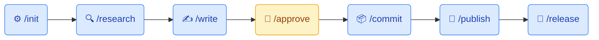

# Open Academic Agent — Agentic Academic Research & Writing Framework

An agentic framework that accelerates the production of academic conclusion papers by automating repetitive research and writing tasks. Researchers and students focus on learning and deepening their work; the agent handles structure, formatting, drafting, and publishing.

> **Norm compatibility:** currently supports Brazilian academic writing norms (ABNT). Contributions to support other norms and models are welcome.

---

## Table of Contents

- [How It Works](#how-it-works)
- [Commands](#commands)
- [Dependencies](#dependencies)
- [Quick Start](#quick-start)
- [Folder Structure](#folder-structure)
  - [docs/](#docs--research-documents)
  - [prompts/](#prompts--saved-prompts)
- [Principles](#principles)
- [License](#license)

---

## How It Works

Each stage is driven by a slash command — the agent executes, the human reviews and approves.



🟦 **Agent** — automated by the framework &nbsp;&nbsp; 🟨 **Human** — requires your review and decision

---

## Commands

### `/init`
Initializes the research context for a new academic project. Asks guided questions about your research topic, area, problem, and approach, then saves a **Research Context** section to `CLAUDE.md` so the agent always knows what you are working on. Run this **once** before starting any other command.

### `/research [prompt or docs]`
Starts an agentic research session. The agent searches, summarizes, and structures findings using a research template, then saves the result in the `research/` folder.

To use documents from your local library, place them in `docs/` before running the command — see the [docs/ section](#docs--research-documents) below.

### `/write [research-file] [segment]`
Drafts a specific section of the conclusion paper (e.g., `methodology`, `introduction`) based on the given research file. Output is saved in `write/` with a status header:
- `pending` — awaiting human review
- `approved` — validated by the researcher
- `committed` — already consolidated into the final document

### `/approve [write-file]`
Marks a write file as `approved`. This is a human-driven step — open the file, read it, then run this command when satisfied.

### `/commit [write-file]`
Consolidates an `approved` write file into the final paper document in `build/`. The document grows incrementally following ABNT norms and is exported to `build/paper.docx` via pandoc. Only approved files can be committed.

### `/publish`
Reads all pending git diffs, generates a commit message automatically, and pushes to the configured remote repository. Requires git to be initialized and a remote configured.

### `/release`
Exports the consolidated document to a versioned PDF in `dist/`. Each release gets an incremental prefix:
```
dist/
  1-release-paper.pdf
  2-release-paper.pdf
```

### `/format [URL | docs/<file> | "plain-language adjustment"]`
Refines the formatting rules used when writing and generating the paper. Accepts three input types:
- **URL** — fetches a public document (e.g., your university's TCC formatting guide) and extracts the rules
- **`docs/<file>`** — reads a local file from your `docs/` folder
- **Plain-language text** — applies a specific adjustment (e.g., `"left margin 4 cm"`, `"Times New Roman font"`)

Changes are compared against the current rules and shown to you before being applied. Once confirmed, `/format` updates both `CLAUDE.md` and the internal writing rules so that every subsequent `/write` produces output that matches your institution's standards. Run without arguments to see the current formatting rules.

---

## Folder Structure

```
tcc/
├── docs/          # Source documents for research (not versioned by default)
├── prompts/       # Saved prompts for reuse (not versioned by default)
├── research/      # Research outputs from /research
├── write/         # Draft sections from /write
├── build/         # Incremental consolidated document
└── dist/          # Versioned PDF releases
```

### `docs/` — Research Documents

Place here any documents you will use as a research base: articles, books, PDFs, summaries, lecture notes, etc. The `/research` command can reference these files as primary sources.

> **Copyright notice:** By default, the contents of `docs/` are listed in the framework's `.gitignore` and **are not versioned**. This protects you from accidentally publishing copyrighted material (paywalled articles, books, etc.) to a public or private repository. The folder itself is kept in git via `.gitkeep`.
>
> If you want to version a specific document (e.g., your own production or openly licensed material), remove the corresponding entry from `.gitignore` — but make sure you have the right to distribute the file before doing so.

### `prompts/` — Saved Prompts

Use this folder to write long prompts as `.md` or `.txt` files before sending them to the chat. This prevents losing a carefully crafted prompt if the session closes or the browser restarts.

```
prompts/
  initial-context.md
  methodology-prompt.md
```

You can reference the file directly in the conversation or copy and paste its content when ready.

> **Note:** The contents of `prompts/` are also gitignored by default, since prompts may contain personal context or temporary drafts. If you want to version a prompt (e.g., reusable team prompts), remove the entry from `.gitignore`.

---

## Dependencies

This framework currently runs inside **[Claude Code](https://claude.ai/code)**. Contributions to support other models are welcome.

| Dependency | Required for | Install |
|---|---|---|
| [Claude Code](https://claude.ai/code) | Running all commands | [claude.ai/code](https://claude.ai/code) |
| [pandoc](https://pandoc.org/installing.html) | `/commit` (DOCX output), `/release` (PDF/DOCX output) | [pandoc.org/installing.html](https://pandoc.org/installing.html) |
| A LaTeX distribution (e.g., [TeX Live](https://tug.org/texlive/), [MiKTeX](https://miktex.org/)) | `/release` (PDF output only) | See your OS instructions |

> **pandoc is optional** — if it is not installed, `/commit` will still update `build/paper.md` and `/release` will fall back to saving a `.md` file. You will be prompted with installation instructions when the command runs.
>
> **LaTeX is optional** — if a LaTeX engine is unavailable, `/release` will fall back to generating a `.docx` instead of a `.pdf`.

---

## Quick Start

### Starting a new project

1. **Fork the repository** — create your own copy of the framework on GitHub to version your conclusion paper independently:
   ```
   # On GitHub, click "Fork", then clone your fork:
   git clone https://github.com/your-username/open-academic-agent.git
   cd open-academic-agent
   git remote add upstream https://github.com/jeansouzak/open-academic-agent.git
   ```

2. **Initialize your research context** — the agent will guide you through the key questions about your topic:
   ```
   /init
   ```

3. Place your reference documents in the `docs/` folder (articles, PDFs, notes).

4. Start a research session:
   ```
   /research What are the applications of machine learning in healthcare?
   ```

5. Write a section of the conclusion paper based on the research:
   ```
   /write research/ml-healthcare.md introduction
   ```

6. Open `write/introduction-<date>.md`, review it, then approve:
   ```
   /approve write/introduction-<date>.md
   ```

7. Consolidate into the final document:
   ```
   /commit write/introduction-<date>.md
   ```

8. When ready to save progress to your repository:
   ```
   /publish
   ```

9. To generate a release PDF:
   ```
   /release
   ```

---

## Principles

- The agent never fabricates data, results, or scientific claims.
- All scientific content must come from the researcher or provided sources.
- The agent handles structure, formatting, standardization, and organization.
- Every section goes through a **draft → review → approval** cycle before being committed.

---

## License

This framework is open source, released under the [MIT License](LICENSE).
